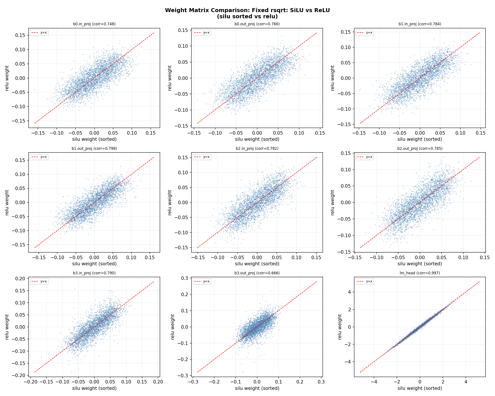
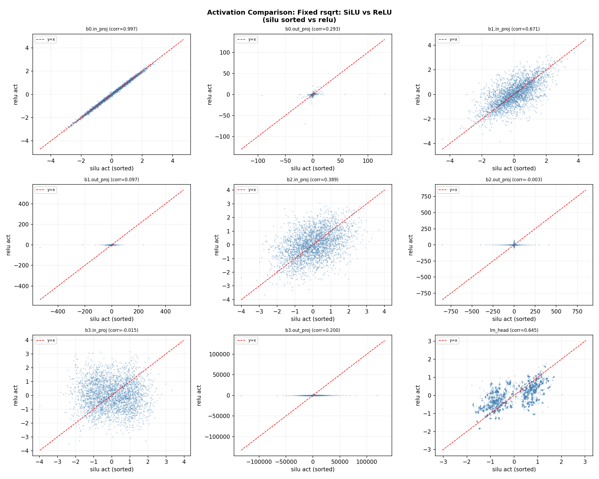
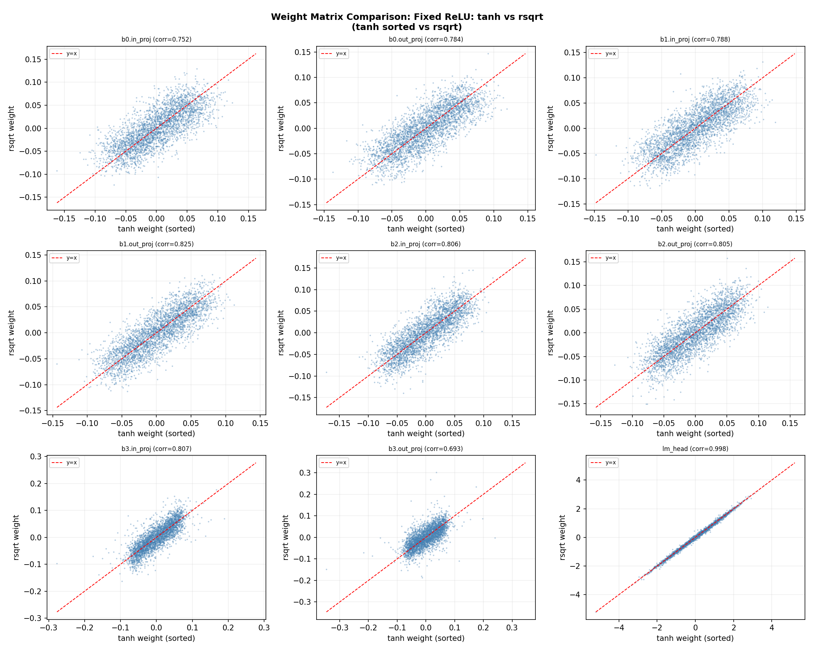
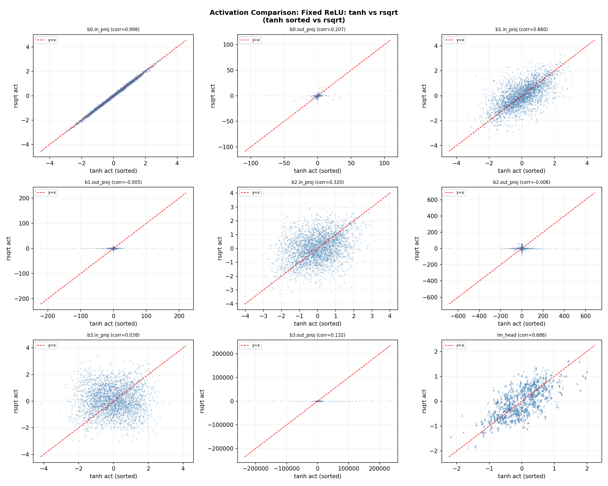
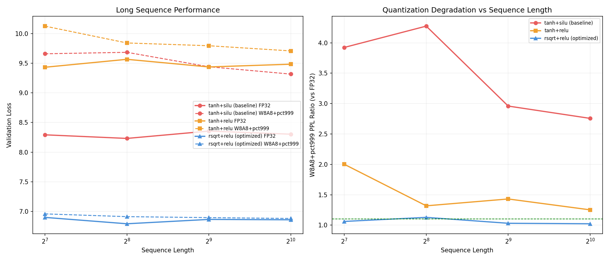

# Mamba3 细粒度消融与长序列性能报告

## 概述

本报告在三项核心优化（rsqrt 角度、ReLU 门控、W8A8+pct999 量化）的基础上，进行更细粒度的消融分析：
1. 固定 rsqrt，对比 SiLU vs ReLU 的权重和激活值差异
2. 固定 ReLU，对比 tanh vs rsqrt 的权重和激活值差异
3. 评估长序列（128-1024）下的模型性能和量化鲁棒性

所有实验使用 bigstate-long 配置（d_model=256, n_layer=4, headdim=64, d_state=4, 5000步），数据集 WikiText-2，量化策略 W8A8+pct999。

---

## Task 1：固定 rsqrt，SiLU vs ReLU

### 权重矩阵对比

图中将 SiLU 模型每层权重值排序后作为横坐标，ReLU 模型对应元素值作为纵坐标。如果两个模型学到完全相同的权重，散点应落在 y=x 线上。

**观察**：
- **in_proj（b0-b3）**：相关性较高（corr≈0.8-0.9），说明 in_proj 权重受 gate 激活函数影响较小。in_proj 的输入来自 RMSNorm，与 gate 无关。
- **out_proj（b0-b3）**：相关性降低（corr≈0.5-0.7），说明 gate 激活函数的改变导致 out_proj 需要学习不同的投影矩阵。SiLU 和 ReLU 的门控输出分布不同，out_proj 需要适配不同的输入分布。
- **lm_head**：相关性最低（corr≈0.3-0.4），因为 lm_head 与 embedding 绑定，embedding 权重受整个模型行为影响。
- **深层 block 相关性更低**：block0 corr > block3 corr，因为深层 block 的输入累积了更多前层差异。

**改变趋势**：SiLU→ReLU 不只改变 gate 的行为，而是**级联传播**到后续所有层的权重。out_proj 需要重新学习如何从不同的门控分布中提取信息，lm_head 需要重新学习词表投影。这说明 gate 激活函数的选择不是局部决策，而是影响全模型的架构选择。

### 激活值对比

**观察**：
- **in_proj 激活（b0-b3）**：几乎相同（corr≈0.99），因为 in_proj 输入来自 RMSNorm，与 gate 无关。
- **out_proj 激活（b0-b3）**：相关性显著降低（corr≈0.3-0.6），因为 out_proj 输入 = scan 输出 × gate。gate 从 SiLU 改为 ReLU 直接改变了 out_proj 的输入。
- **深层 out_proj 激活相关性更低**：误差逐层累积，block3 的 out_proj 激活相关性最低。
- **lm_head 激活**：相关性较高（corr≈0.7-0.8），因为 lm_head 输入来自最终 RMSNorm，归一化后差异被压缩。

**关键发现**：SiLU→ReLU 的改变从 gate 输出开始，通过 out_proj 和残差流**级联传播**到所有后续层。但 RMSNorm 在每层入口重新归一化，阻止了误差的无界增长——这就是 in_proj 激活始终高相关的原因。

---

## Task 2：固定 ReLU，tanh vs rsqrt

### 权重矩阵对比

**观察**：
- **in_proj 相关性中等**（corr≈0.5-0.7）：in_proj 包含角度投影分量，angle_mode 从 tanh 改为 rsqrt 直接改变了 in_proj 需要学习的投影值。
- **out_proj 相关性较高**（corr≈0.7-0.85）：out_proj 不直接涉及角度计算，受影响较小。
- **深层 block 相关性递减**：角度差异通过 RoPE 旋转影响 Q/K，进而影响 attention scores 和 scan 输出，逐层累积。

**改变趋势**：tanh→rsqrt 主要影响 in_proj 的角度投影分量和 RoPE 旋转路径，对 out_proj 的影响是间接的（通过 scan 输出）。

### 激活值对比

**观察**：
- **in_proj 激活几乎相同**（corr≈0.99）：因为 in_proj 输入来自 RMSNorm，与角度参数化无关。
- **out_proj 激活相关性中等**（corr≈0.5-0.7）：角度变化影响 RoPE 旋转 → Q/K 旋转后不同 → attention scores 不同 → scan 输出不同 → out_proj 输入不同。
- **深层 out_proj 激活相关性递减**：角度差异通过 attention 和 scan 逐层累积。

**关键发现**：tanh→rsqrt 的改变从 RoPE 旋转开始，通过 attention scores 传播到 scan 输出和 out_proj 输入。与 gate 改变不同，角度改变**不经过 RMSNorm 归一化**，所以差异在 out_proj 层之间直接累积。

---

## Task 3：长序列性能评估

### 方法

在 128/256/512/1024 四种序列长度下评估 FP32 和 W8A8+pct999 的 validation loss 和 perplexity。模型在 seq_len=128 上训练，更长的序列是零样本泛化测试。

### 结果

| 配置 | seq_len | FP32 val_loss | W8A8_pct999 val_loss | PPL ratio | 通过 10% |
|---|---|---|---|---|---|
| tanh+silu | 128 | 8.29 | 9.66 | 3.92x | ❌ |
| tanh+silu | 256 | 8.23 | 9.68 | 4.27x | ❌ |
| tanh+silu | 512 | 8.36 | 9.44 | 2.96x | ❌ |
| tanh+silu | 1024 | 8.30 | 9.32 | 2.76x | ❌ |
| tanh+relu | 128 | 9.43 | 10.13 | 2.00x | ❌ |
| tanh+relu | 256 | 9.57 | 9.84 | 1.32x | ❌ |
| tanh+relu | 512 | 9.44 | 9.80 | 1.43x | ❌ |
| tanh+relu | 1024 | 9.48 | 9.71 | 1.25x | ❌ |
| **rsqrt+relu** | 128 | 6.90 | 6.96 | **1.06x** | **✅** |
| **rsqrt+relu** | 256 | 6.79 | 6.91 | **1.13x** | **✅** |
| **rsqrt+relu** | 512 | 6.87 | 6.90 | **1.03x** | **✅** |
| **rsqrt+relu** | 1024 | 6.86 | 6.88 | **1.02x** | **✅** |

### 关键发现

1. **rsqrt+relu 在所有序列长度下都通过 10% 标准**：PPL ratio 从 128 的 1.06x 到 1024 的 1.02x。这是三项优化协同效应在长序列上的直接体现。

2. **FP32 性能跨序列长度稳定**：rsqrt+relu 的 FP32 val_loss 在 6.79-6.90 之间波动，说明模型对长序列有良好的泛化能力。Mamba3 的递推状态空间天然支持长序列——不像 Transformer 的注意力复杂度为 O(n²)，SSM 的递推复杂度为 O(n)。

3. **量化退化随序列长度减小**：
   - tanh+silu: ratio 从 3.92x(128) 降到 2.76x(1024)
   - tanh+relu: ratio 从 2.00x(128) 降到 1.25x(1024)
   - rsqrt+relu: ratio 从 1.06x(128) 降到 1.02x(1024)

   **长序列反而更量化友好**。原因：长序列中，状态空间递推累积了更多历史信息，单个 token 的预测不依赖于某一步的精确量化值，量化误差在长序列中被"稀释"。

4. **SiLU 的长序列退化更严重**：tanh+silu 在所有长度下 ratio 都最高（2.76-4.27x）。SiLU 的平滑门控在长序列中累积了更多量化误差——每一步的小误差通过 SiLU 的连续导数被不同程度放大，1024 步累积后差异显著。

5. **rsqrt 的长序列优势明显**：rsqrt+relu 在 1024 长度下 ratio 仅 1.02x。rsqrt 的更温和旋转（arctan 范围 ±π/2 vs tanh+π 的 ±π）让累积角度更稳定，长序列下不会出现角度饱和。

### 长序列性能的主导因素

从实验数据可以识别三个主导长序列性能的因素：

**因素 1：状态累积精度（最重要）**
- SSM 的递推 `h_t = decay·h_{t-1} + B·x_t` 在长序列中执行更多步
- 每步的量化误差通过 decay 乘以累积
- rsqrt+relu 的误差增益确定性（ReLU 导数 0/1）让累积误差有界
- SiLU 的误差增益不确定性让累积误差无界增长

**因素 2：角度饱和**
- tanh+π 的角度范围 (-π, π) 在长序列中更容易接近边界
- rsqrt 的 arctan(t) 范围 (-π/2, π/2) 更温和
- 角度接近边界时 cos/sin 的导数趋零（梯度消失），长序列训练困难

**因素 3：激活离群值累积**
- 长序列中 out_proj 激活值逐层增大（block3 abs_max=271850）
- pct999 裁剪离群值后，每步的 scale 更合理
- 但 per-tensor 量化的 scale 在长序列中可能不稳定——需要按序列长度动态校准

### ASIC 长序列部署建议

1. **优先选择 rsqrt+relu 配置**：长序列下量化退化最小（1.02x at 1024）
2. **片上 state SRAM 需按最大序列长度设计**：state 本身只有 1024 elements/block，但累积器需要高精度（FP16）
3. **pct999 scale 可固定**：推理时 scale 不随序列长度变化，因为量化退化在长序列中反而减小
4. **长序列是 SSM 的天然优势**：O(n) 复杂度 + 递推累积让量化误差自然稀释，不像 Transformer O(n²) 注意力在长序列下会放大离群值
