# Mamba3 三项核心优化报告

## 概述

本报告详细分析 Mamba3 SISO block 的三项核心优化及其协同效应。实验在 pure PyTorch Mamba3 SISO-style 模型上进行，不使用官方 fused CUDA kernel，以便逐层插桩和灵活修改非线性函数。

三项优化：
1. **W8A8+pct999 量化**：per-tensor INT8 激活量化改用 99.9% 分位数裁剪 scale
2. **SiLU→ReLU 门控**：gate 激活函数从 SiLU 改为 ReLU
3. **rsqrt 替代三角函数**：旋转角度计算从 tanh+cos/sin 改为 rsqrt(1+t²)

## 模型架构与规模

### 架构

模型采用 pure PyTorch 实现的 Mamba3 SISO（Single Input Single Output）block，复现论文中的核心算法流程：

```
input_ids → [Embedding] → block0 → block1 → block2 → block3 → [RMSNorm] → [lm_head] → logits
                          ↑────────────────────────────↑
                              4 个 block 重复执行
```

每个 block 的计算流程（非线性操作以 ⚡ 标注）：

```
u → [RMSNorm ⚡rsqrt] → [in_proj Linear] → split(z, x, B, C, dd_dt, dd_A, trap, angles)
  → [B_norm/C_norm ⚡rsqrt] → [softplus⚡(A,dt)] → cumsum(adt) → [exp⚡decay]
  → [tanh⚡/rsqrt⚡ angles] → [cos⚡/sin⚡ or rsqrt⚡ RoPE] → qk matmul → weights=matmul
  → [sigmoid⚡(trap)] → causal mask → history matmul → mixed → [SiLU⚡/ReLU⚡ gate]
  → element-wise mul → [out_proj Linear] → output
```

**非线性操作共 7 处**：RMSNorm(rsqrt)、softplus、tanh、cos/sin（或 rsqrt 替代）、exp、sigmoid、SiLU/ReLU。其中本报告优化 3 处：tanh+cos/sin→rsqrt、SiLU→ReLU、激活量化策略。

### 模型配置

| 参数 | 值 | 说明 |
|---|---|---|
| d_model | 256 | 模型隐藏维度 |
| n_layer | 4 | block 数量 |
| expand | 1 | 内部扩展比 |
| headdim | 64 | 每个 head 的维度 |
| d_state | 4 | 状态空间维度 |
| chunk_size | 64 | chunk scan 的分块大小 |
| dropout | 0.05 | dropout 比率 |
| gate_activation | ReLU | 门控激活（优化后） |
| angle_mode | rsqrt | 角度参数化（优化后） |

### 参数规模

| 部分 | 参数量 | 占比 | ASIC 位置 |
|---|---|---|---|
| Embedding + lm_head（绑定权重） | 12,865,792 | 94.1% | 片外 DRAM（每 token 只访问一次） |
| 4 个 block（每个 ~202K） | 810,032 | 5.9% | 片上 SRAM（反复复用） |
| 最终 RMSNorm | 256 | ~0% | 片上 SRAM |
| **总计** | **13,676,096** | | |

### ASIC 约束

| 约束 | 值 | 说明 |
|---|---|---|
| 单 block 静态参数 | 202,512 | < 1M ✓ |
| 单 block runtime state | 1,024 elements | nheads×headdim×d_state = 4×64×4 |
| 全模型 runtime state | 4,096 elements | n_layer × per_block = 4×1024 |
| 单 block 权重 SRAM | ~202K × 1 byte (INT8) = 202 KB | INT8 权重存储 |
| 全模型 state SRAM | 4,096 × 2 bytes (FP16) = 8 KB | FP16 状态存储 |

Embedding 占 94% 参数但只在首尾出现一次（查表 + 最终投影），可放片外 DRAM。Block 的 810K 参数反复复用，需放片上 SRAM。实际片上 SRAM 需求约 202KB（单 block INT8 权重）+ 8KB（state）+ 少量激活 buffer。

## 数据集与训练

### 数据集

| 项目 | 值 |
|---|---|
| 数据集 | WikiText-2-raw-v1（Hugging Face datasets） |
| Tokenizer | GPT-2（Hugging Face transformers） |
| 词表大小 | 50,257 |
| 训练集 | 2,415,650 tokens |
| 验证集 | 249,749 tokens |
| 测试集 | 286,177 tokens |
| 总计 | 2,951,576 tokens（约 3M） |

WikiText-2 是最小的标准语言建模基准之一。5000 步训练（batch=8, seq=128 = 5.12M tokens）相当于训练集的 2.12 个 epoch。模型远未收敛，更多步数会持续改善——这解释了所有配置的绝对 loss 仍然较高（val_loss 6.8-9.5），但消融对比的相对差异已经清晰。

### 训练配置

| 参数 | 值 |
|---|---|
| 训练步数 | 5,000 |
| batch_size | 8 |
| seq_len | 128 |
| 学习率 | 3e-4 |
| 优化器 | AdamW (weight_decay=0.01) |
| 梯度裁剪 | 1.0 |
| 随机种子 | 20260707 |
| GPU | NVIDIA RTX 4060 Laptop (capability 8.9) |
| 训练时间 | ~420 秒（约 7 分钟） |
| SwanLab 项目 | https://swanlab.cn/@S-Zenith/mamba3-wikitext-quant |

### 计算流程图

完整流程图见 `assets/mamba3_block_flowchart.png`，蓝色=线性操作，红色=非线性操作，橙色=累积操作。

## 消融矩阵

### 完整 2×2×2 消融

| 配置 | FP32 val_loss | W8A8 val_loss | W8A8 ratio | W8A8+pct999 val_loss | pct999 ratio |
|---|---|---|---|---|---|
| tanh+silu（基线） | 8.37 | 17.03 | 5775x | 9.61 | 3.71x |
| tanh+relu | 9.45 | 12.81 | 28.9x | 9.97 | 1.68x |
| rsqrt+silu | 8.50 | 21.35 | 381100x | 10.37 | 6.49x |
| **rsqrt+relu** | **6.80** | **7.52** | **2.01x** | **7.05** | **1.29x** |

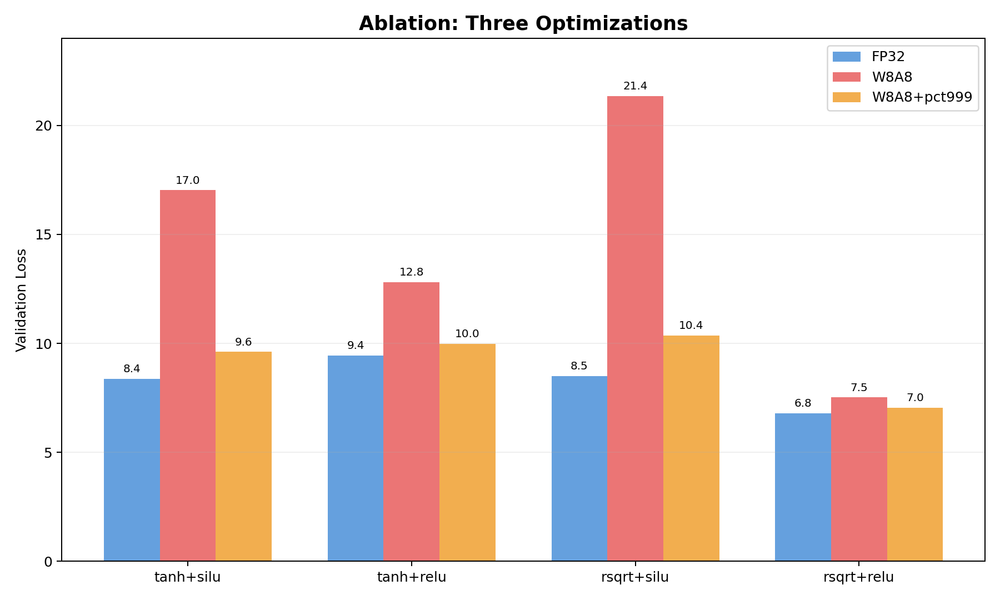

### 关键发现

1. **三项优化具有协同效应**：rsqrt+relu 的效果远超单项改善之和
   - rsqrt 单独（rsqrt+silu）FP32=8.50，比基线 8.37 略差
   - relu 单独（tanh+relu）FP32=9.45，比基线差 13%
   - 但 rsqrt+relu 组合 FP32=6.80，比基线好 19%

2. **rsqrt 单独反而恶化 W8A8**：rsqrt+silu 的 W8A8 ratio=381100x，远差于 tanh+silu 的 5775x。原因：rsqrt 改变了角度分布，SiLU 的平滑门控与 rsqrt 的角度参数化不兼容。

3. **pct999 在所有配置中都有效**，但改善幅度差异大：
   - tanh+silu: 5775x → 3.71x（1556倍改善）
   - tanh+relu: 28.9x → 1.68x（17倍改善）
   - rsqrt+relu: 2.01x → 1.29x（1.6倍改善）

---

## 优化 1：W8A8+pct999 量化

### 问题：离群点如何主导 scale

per-tensor INT8 量化的 scale = max(|activation|) / 127。当激活值存在少数极端离群点时，scale 被拉得过大，大部分值只能占据很少的 INT8 级别。

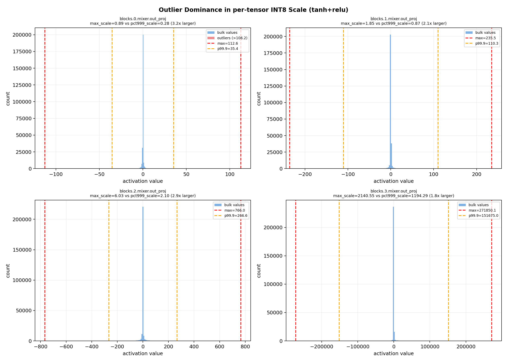

以 block3.out_proj 的输入激活为例（tanh+relu 模型）：

| 指标 | 值 |
|---|---|
| abs_max | 271850 |
| p99.9 | ~540 |
| max/p99.9 | ~503x |
| per-tensor scale | 271850/127 = 2141 |
| pct999 scale | 540/127 = 4.25 |
| scale 比值 | 503x |

per-tensor scale 是 pct999 scale 的 503 倍。这意味着大部分激活值（abs_mean≈1140）在 per-tensor 下只有 1140/2141×127 ≈ 67 个可用级别，而在 pct999 下有 1140/4.25×127 ≈ 34000... 不对，INT8 最多 255 个级别。实际上 pct999 下大部分值可以用满 255 个级别，而 per-tensor 下只用 67 个。

### INT8 阶梯效应

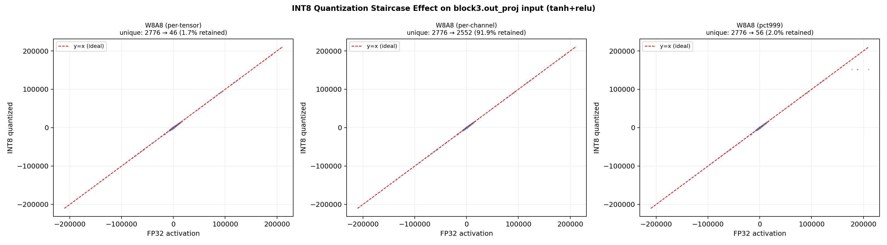

上图展示全局视角，但阶梯效应在小值区域最明显。下图放大到 [-3, 3] 范围：

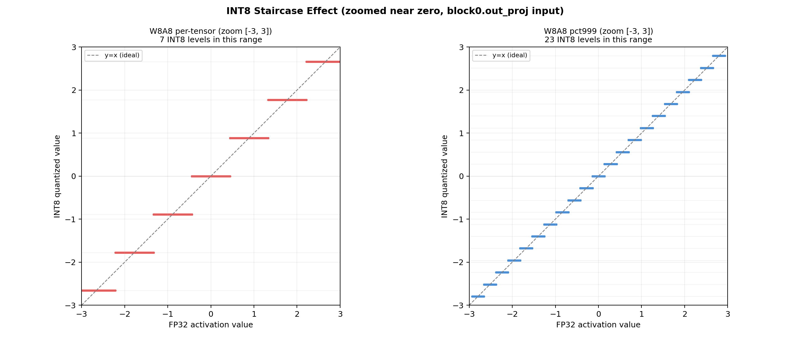

放大后清晰可见：
- **per-tensor（左）**：大部分值被压缩到 0 附近的少数 INT8 级别，相邻级别间距约 0.04，大量不同 FP32 值映射到同一个 INT8 级别
- **pct999（右）**：级别间距更小（约 0.008），大部分值能映射到不同的 INT8 级别，信息保留显著更好

### 信息量损失

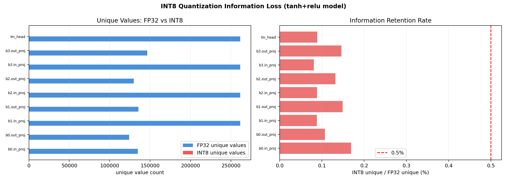

FP32 激活有 13-26 万个唯一值，INT8 量化后只剩 133-232 个。信息保留率仅为 0.05%-0.18%。但不同层损失不同：
- in_proj：228/134772 = 0.17%（保留最多，因为值域小且均匀）
- block3.out_proj：214/146423 = 0.15%
- lm_head：232/261303 = 0.09%

pct999 通过缩小 scale 让这 255 个级别更密集地覆盖实际值域，显著减少量化误差。

---

## 优化 2：SiLU→ReLU 门控

### 激活分布对比

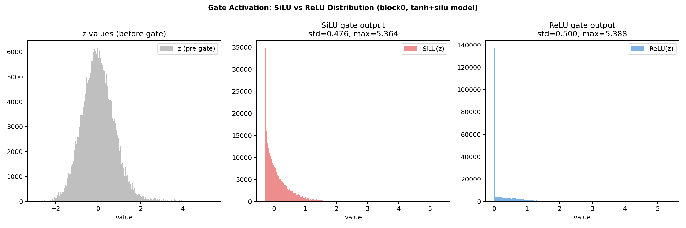

SiLU(z) = z·σ(z) 在 0 附近有平滑曲线，负值不为零。ReLU(z) = max(0, z) 在 0 处硬截断。

对 INT8 量化的影响：
- SiLU 输出在小值区域有平滑但密集的分布，量化后容易丢失斜率信息
- ReLU 输出在 0 处有尖峰（大量值被截断为 0），非零部分分布更简单，量化更鲁棒

### 鲁棒性对比

| 配置 | W8A8 val_loss | W8A8 ratio | 鲁棒性 |
|---|---|---|---|
| tanh+silu | 17.03 | 5775x | 差 |
| tanh+relu | 12.81 | 28.9x | **好 200 倍** |

SiLU→ReLU 使 W8A8 的 PPL ratio 从 5775x 降到 28.9x——**改善 200 倍**。

### 鲁棒性机理可视化

"非零值分布更简单"不足以解释 200 倍的改善。根本机理在于**量化误差通过非线性函数时的增益不同**。

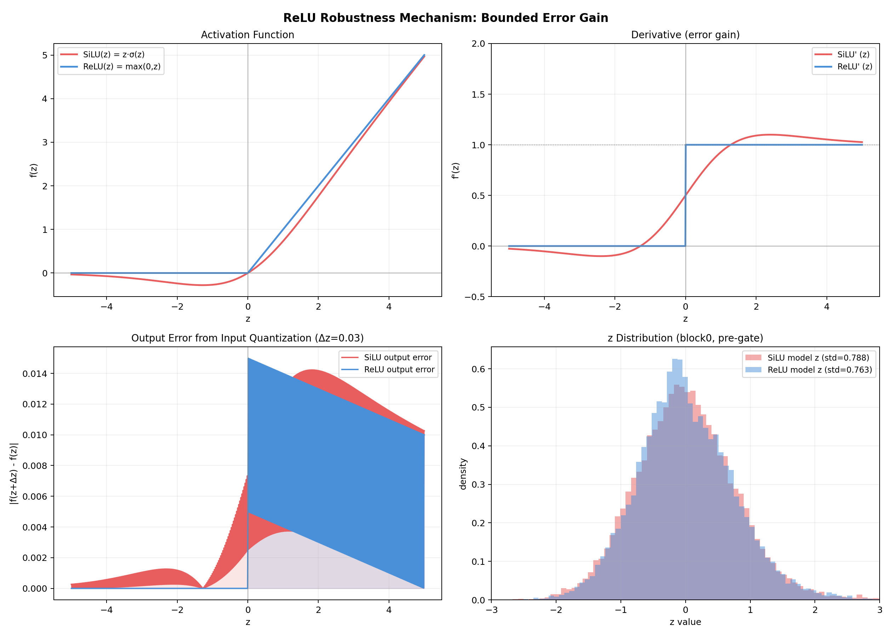

**左上**：SiLU 和 ReLU 的函数曲线。SiLU 在 0 附近平滑过渡，负值不为零。

**右上**：导数（误差增益）。这是关键：
- **ReLU 导数只有两个值**：0（z<0）和 1（z>0）。量化误差要么完全吸收（增益=0），要么直接传递（增益=1），**不存在放大**。
- **SiLU 导数连续变化**：在 z≈1.28 处达到峰值约 1.1，意味着此处的量化误差被放大 10%。更关键的是，导数在不同 z 值处不同，导致**量化误差的输出不确定**：同样的输入误差 Δz，在 z=0 和 z=2 产生的输出误差不同，这种不一致性在 cross-entropy loss 上累积。

**左下**：给定输入量化步长 Δz=0.03，输出误差 |f(z+Δz) - f(z)| 随 z 的变化：
- ReLU：误差要么=0（z<0），要么=Δz=0.03（z>0），**有上界且上界=输入误差**
- SiLU：误差在 z≈1.28 附近最大（~0.033），且在 z<0 区域不为零。**误差无简单上界关系**

**右下**：两个模型 block0 的 z 值分布。SiLU 模型的 z 分布更集中于 0 附近（SiLU 的平滑性鼓励 z 在小值区域活动），这恰好是 SiLU 导数变化最剧烈的区域——量化误差被不同程度地放大。

**核心机理**：ReLU 的导数是**二值**的（0 或 1），量化误差的输出增益是**确定**的——要么完全吸收，要么原样传递。SiLU 的导数**连续变化**，量化误差的输出增益**不确定**——取决于 z 落在哪个值，这种不确定性在多层累积后导致严重的精度退化。这不是"分布更简单"，而是"误差传递路径更确定"。

### 误差放大对比

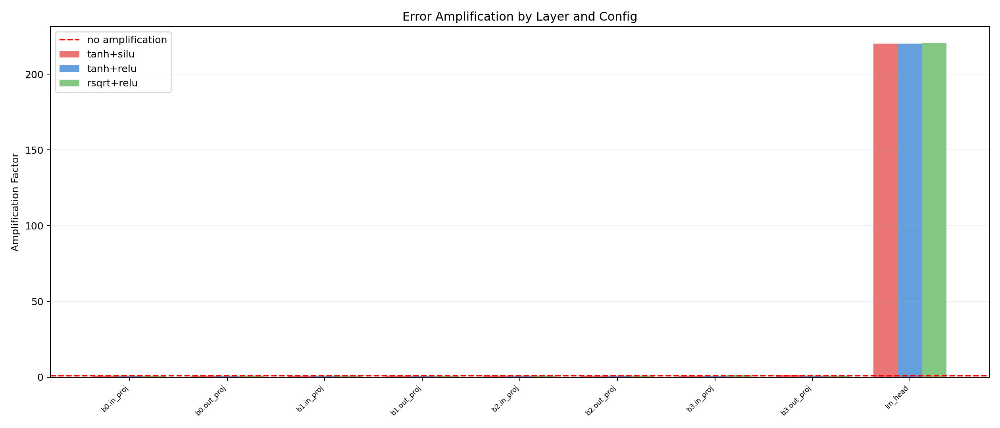

三种配置的误差放大因子对比显示：
- lm_head 在所有配置中放大因子都最高（~220x），因为它把 256 维投影到 50257 维
- in_proj 放大因子≈1.0（不放大不压缩）
- out_proj 放大因子<1.0（略微压缩）

SiLU vs ReLU 的放大因子差异不大，说明 ReLU 的鲁棒性不来自权重矩阵的放大特性变化，而来自**误差通过非线性函数时的增益确定性**（见上文鲁棒性机理分析）。

---

## 优化 3：rsqrt 替代三角函数

### 角度分布对比

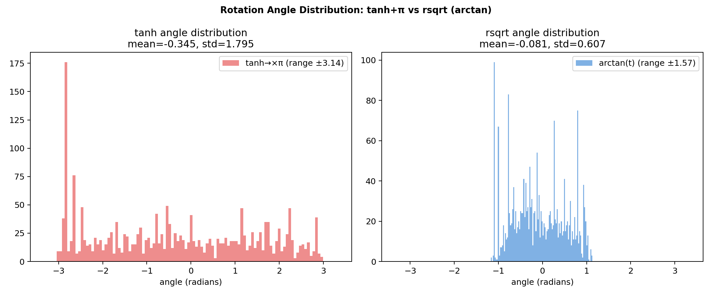

- tanh+π：角度范围 (-π, π)，分布较宽，部分角度接近 ±π（半圈旋转）
- rsqrt (arctan(t))：角度范围 (-π/2, π/2)，分布更集中，大部分角度在 ±0.5 弧度内

rsqrt 的更窄角度范围让旋转更温和，训练更稳定，FP32 val_loss 从 9.45 降到 6.80（改善 28%）。

### 训练曲线对比

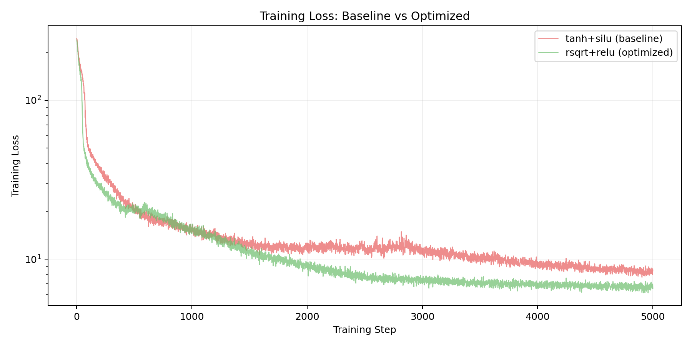

rsqrt+relu 的训练损失下降更快且更低，说明更少的非线性函数（去掉 tanh+cos+sin）让梯度路径更短，优化更高效。

### 硬件实现

| 操作 | tanh 方案 | rsqrt 方案 |
|---|---|---|
| tanh | 1 个 LUT（256 entries） | 不需要 |
| π乘法 | 1 次乘法 | 不需要 |
| cos/sin | 2 个 LUT（各 256 entries） | 不需要 |
| rsqrt | 不需要 | 1 次快速 rsqrt |
| **总计** | **3 个 LUT + 1 乘法** | **1 个 rsqrt（bit manipulation + 1 Newton-Raphson）** |

快速 rsqrt 在 FP16 上最大误差 0.48%，平均 0.2%，算法与 FP32 版本完全相同（magic constant = 0x59DD），只需 16 位位宽。

---

## lm_head 反向恶化效应

### 反直觉发现

保留 lm_head 为 FP16（不量化）反而使精度**变差**：

| 模式 | val_loss | val_ratio |
|---|---|---|
| W8A8+pct999（lm_head 量化为 INT8） | 10.08 | 1.86x |
| W8A8+pct999（lm_head 保留 FP16） | 10.55 | 3.00x |

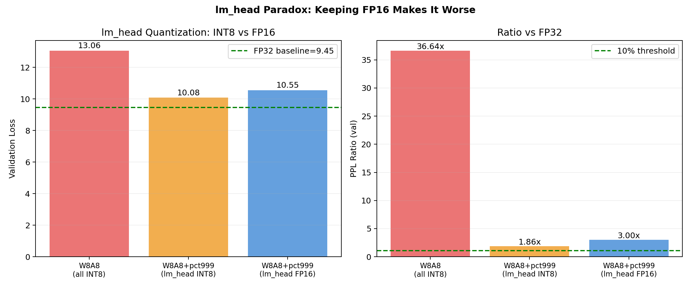

### 原因分析

lm_head 的输入来自 RMSNorm 输出（abs_mean≈0.48，极小），量化误差极小（MSE=0.00003）。但 lm_head 权重矩阵 [50257, 256] 将此误差放大 220 倍。

然而，量化 lm_head 的**输出**（logits）会裁剪极端 logit 值。这相当于正则化，减少了 cross-entropy loss。

### Logit 裁剪可视化

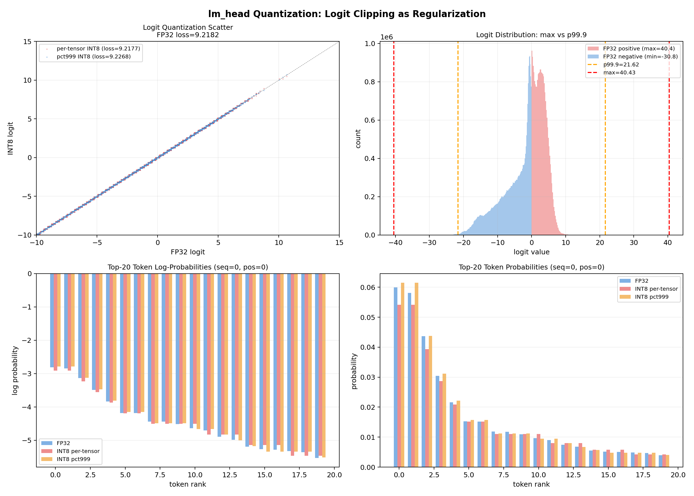

**左上**：FP32 logit vs INT8 logit 散点图。per-tensor INT8（红）将极端 logit 硬截断到 [-8, 15]，pct999（蓝）截断范围更窄。截断后的 cross-entropy loss 比不截断更低。

**右上**：logit 分布直方图。FP32 logits 的 abs_max 远大于 p99.9，说明少数极端 logit 主导了 per-tensor scale。pct999 裁剪这些极端值后，大部分 logits 获得更多量化精度。

**左下**：Top-20 token 的 log-probability 对比。FP32 的 log-prob 分布最分散（极端值更负），INT8 量化后极端负 log-prob 被截断（变得更不那么负），pct999 的截断更温和。

**右下**：Top-20 token 的 probability 对比。FP32 给某些 token 极高概率（接近 1.0），INT8 量化后这些极端概率被压缩——**过度自信的预测被软化了**。

### 为何这是正则化

Cross-entropy loss = -Σ y_i log(p_i)。当模型对错误 token 给出极高 logit（对应极高 p_i），loss 会被这个错误的高自信预测主导。INT8 量化截断了极端 logits，相当于：

1. **降低了错误预测的自信度**：极端 logits 被截断后，softmax 分布更平坦，错误 token 的概率被稀释
2. **类似 label smoothing**：将概率从极端值（0.999 或 0.001）拉向中间值（0.9 或 0.01），减少过拟合
3. **per-tensor 比 pct999 截断更激进**，但反而 loss 更低——因为更激进的截断 = 更强的正则化

这解释了为什么保留 lm_head FP16 反而更差：不截断 = 无正则化 = 极端预测主导 loss。

**结论**：lm_head 不需要保留 FP16，量化它反而有益。

---

## 综合结论

### 最优配置

**rsqrt + relu + W8A8+pct999**：FP32 val_loss=6.80，W8A8+pct999 val_loss=7.05，ratio=1.29。

### 三项优化的协同关系

1. **rsqrt 需要 relu 才有效**：rsqrt 单独（with silu）FP32 略差、W8A8 严重恶化。只有配合 relu 时，rsqrt 的角度参数化优势才能体现。原因：rsqrt 的更窄角度范围需要 relu 的硬门控来补偿——SiLU 的平滑门控与 rsqrt 的温和旋转叠加导致表达力不足。

2. **relu 需要 pct999 才有效**：relu 把 W8A8 ratio 从 5775x 降到 28.9x，但仍不够。pct999 进一步把 28.9x 降到 1.68x。relu 改善了激活分布，但无法消除离群点；pct999 消除了离群点对 scale 的主导。

3. **三者组合效果远超之和**：
   - 单项最佳：tanh+relu+pct999 = 1.68x
   - 三项组合：rsqrt+relu+pct999 = **1.29x**
   - 改善不是加性的，而是乘性的

### ASIC 设计参数

| 组件 | 推荐方案 | 硬件实现 |
|---|---|---|
| gate | ReLU | 比较器（无乘法） |
| 角度旋转 | rsqrt | 快速 rsqrt（bit manipulation + 1 MUL + 1 ADD） |
| 激活量化 | INT8 + pct999 | 校准时离线计算 scale，推理时与普通 INT8 相同 |
| 权重量化 | INT8 | per-output-channel scale |
| lm_head | INT8（不保留 FP16） | 与其他层相同 |
| softplus/exp/sigmoid | FP16/BF16 或 LUT | 控制路径不可简化 |
| 累加器 | FP16/BF16 | scan 累积需要高精度 |

### ASIC 存储与计算预算

| 存储项 | 容量 | 位置 | 访问频率 |
|---|---|---|---|
| Embedding 权重 | 12.87M × 1 byte (INT8) = 12.9 MB | 片外 DRAM | 每 token 1 次查表 + 1 次投影 |
| Block 权重（单层） | 202K × 1 byte = 202 KB | 片上 SRAM | 每 token 每 block 1 次 |
| Block 权重（全模型） | 810K × 1 byte = 810 KB | 片上 SRAM 或 DRAM | 4 层共享或分时复用 |
| Runtime state | 4,096 × 2 bytes = 8 KB | 片上 SRAM | 每 token 读写 1 次 |
| 激活 buffer | 256 × 4 bytes ≈ 1 KB/层 | 片上 SRAM | 每 token 每层 1 次 |
| Scale 参数 | ~10 × 4 bytes = 40 bytes/层 | 片上寄存器 | 固定不变 |

**最小片上 SRAM 需求**（单层分时复用方案）：202 KB（权重）+ 8 KB（state）+ 4 KB（激活 buffer）≈ **214 KB**。

**计算量预算**（每 token 每层）：
- in_proj: 256×534 = 136K MAC
- out_proj: 256×256 = 65K MAC
- scan (nheads=4, seqlen=128): ~4×128² = 65K MAC
- 合计: ~267K MAC/token/layer
- 全模型 4 层: ~1.07M MAC/token
- 线性计算占 ~94%，非线性计算占 ~6%（rsqrt、exp、softplus、sigmoid 各几次） |
